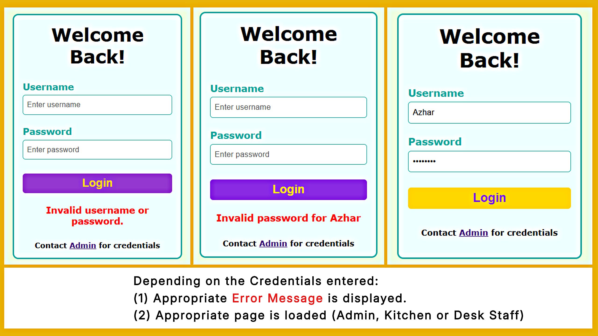
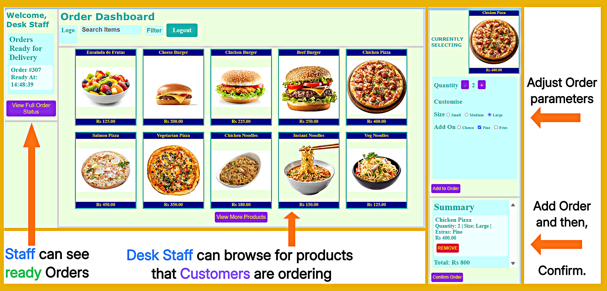
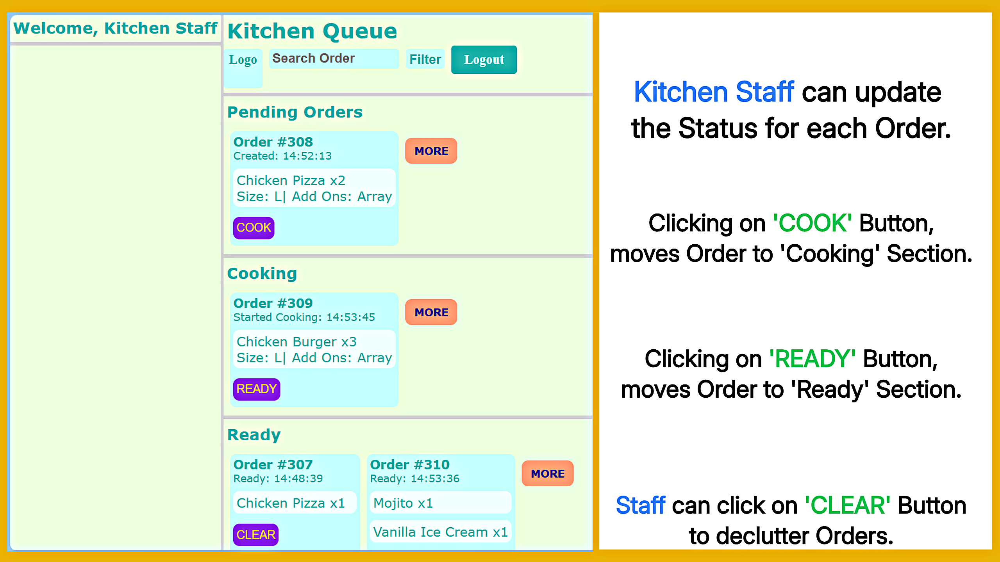
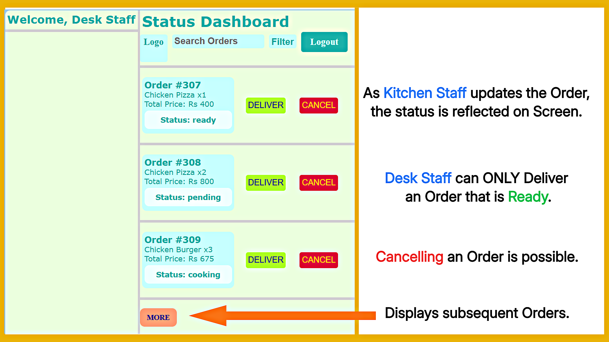
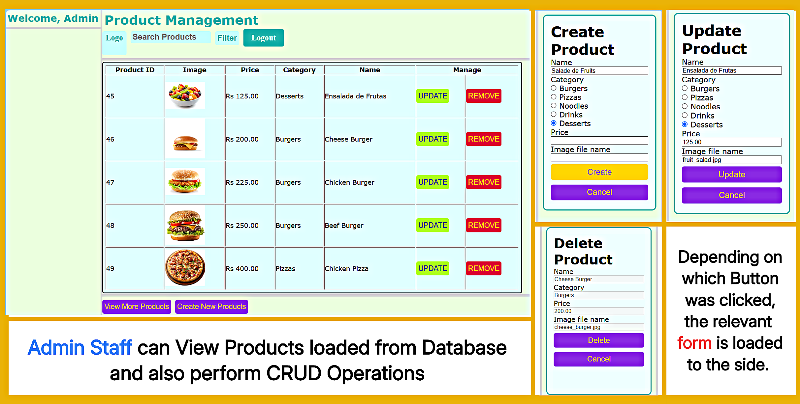

# ISLAND BITES — RESTAURANT ORDER MANAGEMENT SYSTEM

I am building a Full-Stack Order Management System for a small fictional restaurant, using:

| Technology | Purpose                  |
|------------|--------------------------|
| HTML       | Structure                |
| CSS        | User Interface           |
| JavaScript | Client-side interactions |
| PHP        | Server-side processing   |
| MySQL      | Data persistence         |

The project demonstrates a complete overview of how the restaurant operates. From Staff creating the order, to kitchen preparation, and finally order delivery, while enforcing Business rules throughout.

While the project is under active development, an initial stable version has been completely implemented. Version 2 will extend on the existing foundation, while enhancing the functionality and aesthetics.

## 📑 Contents

- [Application Walkthrough](#application-walkthrough)
- [System Features](#system-features)
- [Directory Structure](#directory-structure)
- [Installation Guide](#installation-guide)
- [Documentation](#documentation)

--- 

# APPLICATION WALKTHROUGH

This Section demonstrates the operational workflow of the application, alongside some useful annotated screenshots.

## 1. Login Page

Staff members authenticate themselves by logging into the System. Each role, given separate duties, can only access the page that is relevant to their responsibilities.



## 2. Order Dashboard Page

Once authenticated by the System, the Desk Staff can create Customer orders, which are sent to the Kitchen Queue. The Staff can also review the order summary and also view which orders are ready to be delivered.



## 3. Kitchen Queue Page

Kitchen Staff process incoming orders and can update each order from Pending → Cooking → Ready.



## 4. Order Status Page

The Desk Staff tracks the progress of each order and can either Deliver to Customer or Cancel them, whenever appropriate.



## 5. Admin Page

Administrators manage restaurant products through Create, Read, Update and Delete (CRUD) operations, reflecting changes in the MySQL database.



**_For the original page screenshots without annotations:_**

- **[Login Page](images/full_pages/login_page.png)**
- **[Order Dashboard Page](images/full_pages/order_dashboard_page.png)**
- **[Kitchen Queue Page](images/full_pages/kitchen_queue_page.png)**
- **[Order Status Page](images/full_pages/order_status_page.png)**
- **[Admin Page](images/full_pages/admin_page.png)**

---

# SYSTEM FEATURES

### Authentication
- Role-based login
- Protected pages
- Session management
- Password hashing

### Product Management
- View products
- Create products
- Update products
- Delete products
- Product pagination

### Order Management
- Product selection
- Quantity adjustment
- Order item customisation
- Order summary
- Total order cost

### Kitchen Workflow
- Pending queue
- Cooking queue
- Ready queue
- Order pagination

### Order Tracking
- Live status updates
- Deliver orders
- Cancel orders
- Business rule enforcement

---

# DIRECTORY STRUCTURE

```
island_bites/

├── css/
├── database/
│     └── island_bites.sql
├── docs/
│     └── documentation.md
├── images/
│     └── annotated_pages
│     └── full_pages
│     └── products
│     └── wireframes
├── js/
├── pages/
├── php/         
│     └── configuration.php
│     └── ... # backend processing pages
├── index.php
├── README.md
```

---

# INSTALLATION GUIDE

### Steps:

1. Clone the repository:

```bash
git clone https://github.com/azhar-paraouty/order-management-system.git
```

2. Move or Copy the cloned repository into your web server root directory (e.g. `C:/xampp/htdocs/`).

3. Start Apache and MySQL.

4. Import `database/island_bites.sql` into phpMyAdmin.

5. Open the project in your browser:

```
http://localhost/order-management-system/
```

### Default Accounts:

| Role          | Username | Password |
|---------------|----------|----------|
| Admin         | Admin    | admin123 |
| Desk Staff    | John     | john123  |
| Kitchen Staff | Jane     | jane123  |

> _Note: These accounts are provided for demonstration purposes_.

---

# DOCUMENTATION

_**Detailed software documentation is available in [docs/documentation.md](docs/documentation.md)**_

It includes

- Version 1 requirements
- Version 2 planning
- Design decisions
- Development log
- Future works

---

## 👤 Author

M.A. Azhar Paraouty

BSc (Hons) Information Systems | University of Mauritius

Interested in Data Analytics, Automation and Software Development.